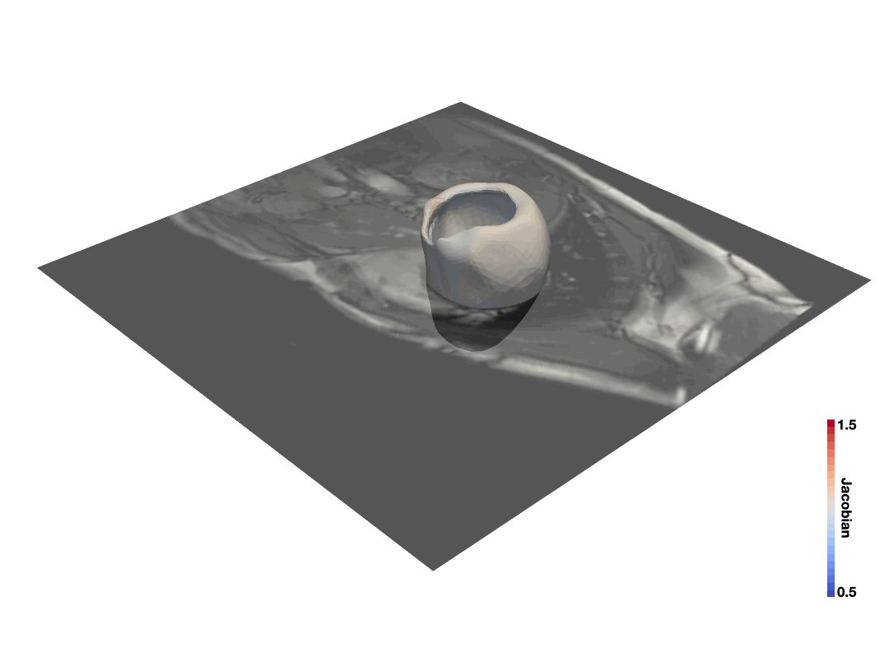

# WarpPINN

Code of the publication:

López, Pablo Arratia, Hernán Mella, Sergio Uribe, Daniel E. Hurtado, and Francisco Sahli Costabal. "WarpPINN: Cine-MR image registration with physics-informed neural networks." Medical Image Analysis 89 (2023): 102925.

```
@article{lopez2023warppinn,
  title={WarpPINN: Cine-MR image registration with physics-informed neural networks},
  author={L{\'o}pez, Pablo Arratia and Mella, Hern{\'a}n and Uribe, Sergio and Hurtado, Daniel E and Sahli Costabal, Francisco},
  journal={Medical Image Analysis},
  volume={89},
  pages={102925},
  year={2023},
  publisher={Elsevier}
}
```


